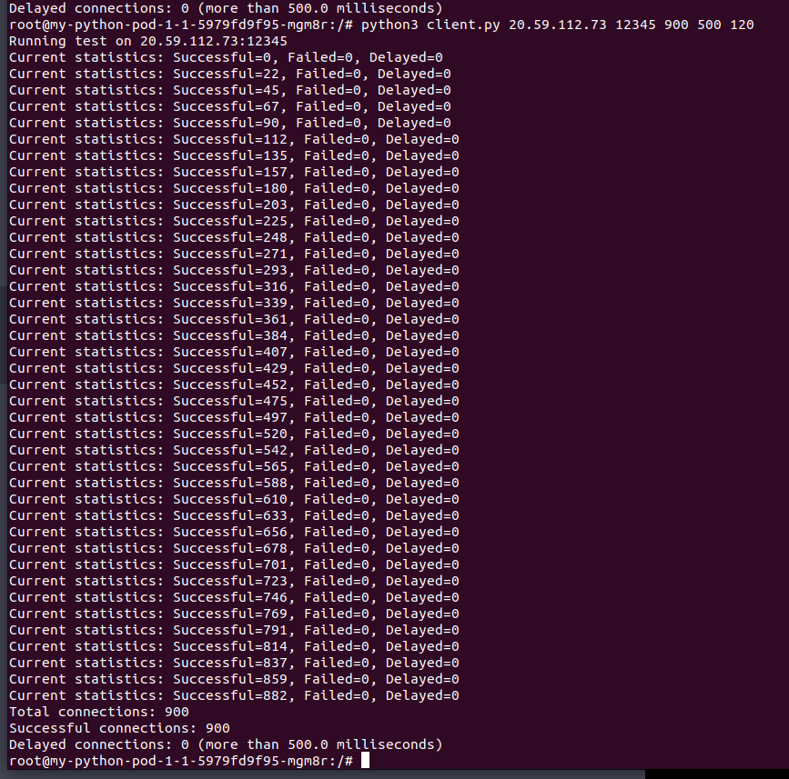

# High Level Issue

Microsoft Azure Kubernetes Cluster is limiting outbound TCP connections per external domain and
Node.

We are only able to make a total of approximately 1200 outbound connections from any one AKS node.
We also appear to be throttled by the number of total concurrent TCP connections we can make to an
outbound domain (outbound outside the cluster but within the same data center) to several hundred per
domain name up to the maximum number of connections per node.

# Tests

## Description of Testing Code Files

### Server
[server.py](server.py) is a simple python server listening for TCP connections

In all tests, this was run on a VM in Azure

Arguments:
* port to listen on
* max number of connections to accept

### Client

Two options for client:
* [client_single_thread.py](client_single_thread.py) - single threaded client
* [client_threaded.py](client_threaded.py) - multi-threaded client

Arguments:
* ips to connect to
* port to connect to
* total number of connections to attempt
* threshold for delayed connections in milliseconds
* timeout for the test in seconds (single threaded only)

## Test 1 - Microsoft AKS cluster test – Pointing at VM in same data center

Server was run on a VM in the same data center as the AKS cluster. Client was run as a pod in AKS.

### Multi-threaded

#### Result

The connections are limited to a total number of several hundred.

### Single-threaded

#### Result

The connections are limited to a total number of several hundred.

## Test 2 - AKS Test using one pode as server and one pod as client

Server was run as a pod in the same AKS cluster as the client. The client and server were scheduled on two different nodes.

#### Result

5000 Connections were attempted and made successfully

## Test 3 - Google Kubernetes cluster test – Pointing at same VM in AZURE data center

Server was run on an Azure VM. Client was run as a pod in a Google Kubernetes cluster.

### Multi-threaded

#### Result

The test was able to make 5000 concurrent connections with 5000 threads no problem.

### Single-threaded

#### Result

The test was able to make 900 single threaded connections and hold them open
without failure.

Same thing with 5000 connections:

